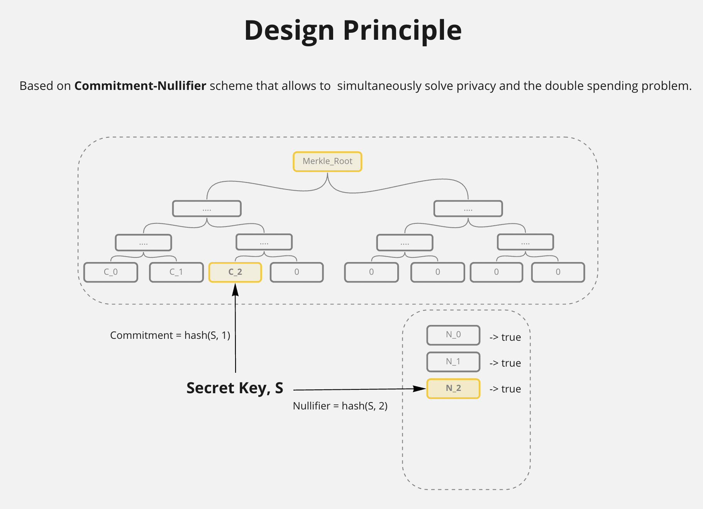
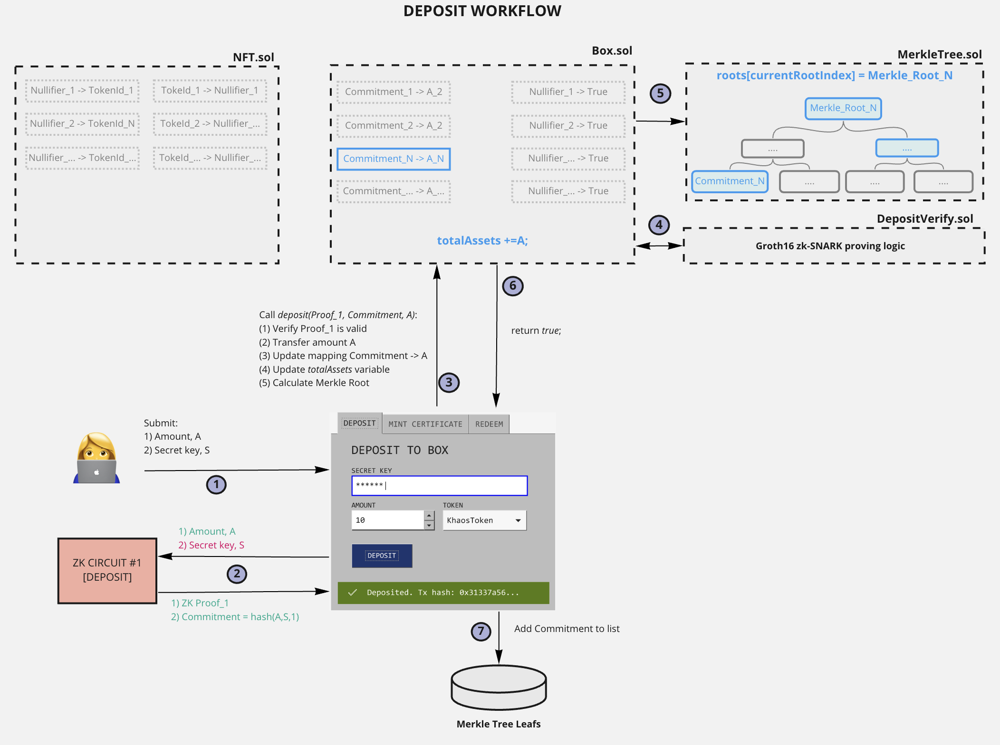
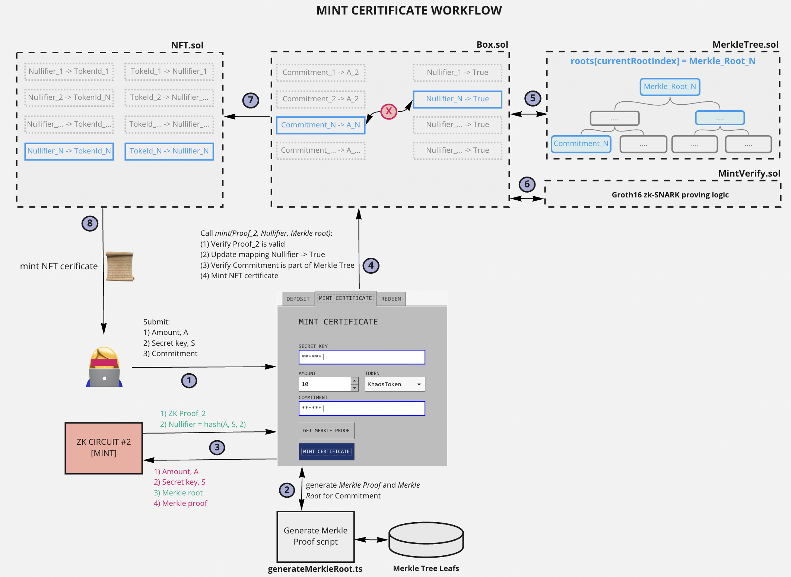
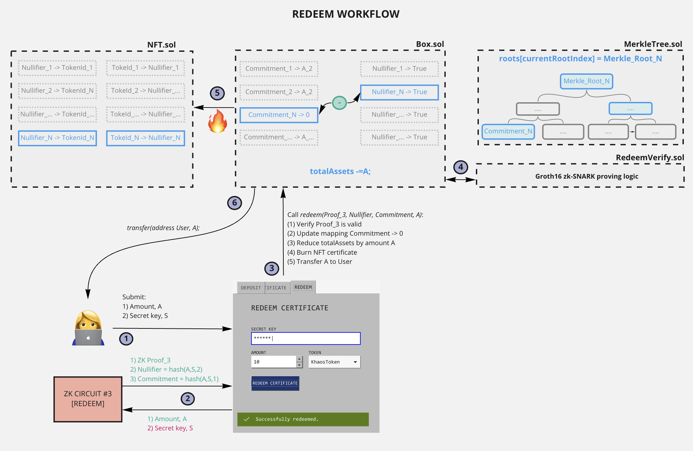

# zkBOX

## Artemis Academy capstone project

 

**zkBOX** aims to ensure private assets holding and enables proof of ownership over some amount of assets without actually revealing the total amount of assets or doxxing financial history by using zero knowledge proof cryptographic technology.

Project presentation slides are [here](https://www.figma.com/proto/F5GlUaPEwp9ftkKiShwOvT/zkBOX?page-id=0%3A1&node-id=1%3A2&viewport=79%2C270%2C0.06&scaling=contain). 
 
 

Design principle is based on commitment-nullifier scheme: anyone who deposits a coin uses a private secret key - S. User locally compute the commitment - ”leaf" L=hash(S,1), which gets published on-chain and becomes part of the state, and N=hash(S,2), which is called the nullifier. The state gets stored in a Merkle tree. This allows to simultaneously solve privacy and the double spending problem.

 
## Deposit workflow

 
## Certificate mint workflow

 
## Assets redeem workflow

 

## Tech stack

- Solidity
- Circom 2.0 (ZK-SNARK Compiler)
- Snarkjs (implementation of the zero-knowledge protocol in javascript)
- Circomlib (library of circom templates)
- Foundry (testing framework)
- Slither (code security analysis)
- Typescript

 

## Usage
 

To **generate new proof** use (replace 'deposit' keyword in example below with required proof: deposit, mint, assert, redeem):  
(1) indicate input data in `./circuit/deposit/deposit_Input.json`  
(2) run `./circuit/deposit/newProof.sh deposit` script   

To **generate merkle tree proof**: 
(1) add new leaf to `./leafs.txt`  
(2) run `./generateMerkleTree.ts`   

For **testing typical workflow** use `forge test -vvvv` command
